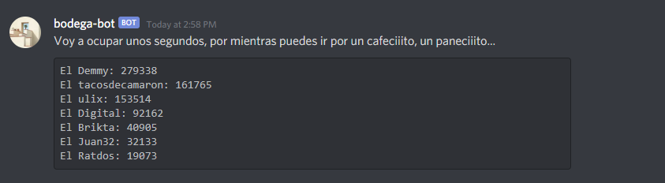

# Bodega Bot

Bodega-Bot is a Discord bot that can be configured to monitor and produce humorous analytics for Discord channels.

## Installation

```
pip install bodega-bot
```

## Usage

### CLI

To spin up a simple bodega-bot:

```
$ bodega-bot -b <your bot token>
```

Refer to the **Options** section below for all the different optional arguments that bodega-bot supports.

### Configuration file

It is possible to pass the inputs to bodega-bot through a .json configuration file. If done this way, the path to the config file needs to be passed as an input:

```
$ bodega-bot -c /path_to_config_file/config.json
```

## Options

| Argument                         | Description                        |
| -------------------------------- | ---------------------------------- |
| --help, -h                       | Show help message and exit.        |
| -bot_token, -b                   | Discord Bot token.                 |
| --db_url, -d                     | Database url or connection string. |
| --config-path, --config_path, -c | Filepath to configuration file.    |
| --giphy-key, --giphy_key, -gk    | Giphy API Key.                     |

## Discord Bot Commands

| Command                    | Description                                                                                                    |
| -------------------------- | -------------------------------------------------------------------------------------------------------------- |
| `.stats`                   | Ranks users in descending order by total number of chars typed.                                                |
| `.trend <number of weeks>` | Uploads a trend plot of user's statistics over the past `number of weeks`.                                     |
| `.keyword <user keyword>`  | Automatically posts a gif for a particular user based on `user keyword`. This action is on a 12 hour cooldown. |

## Screenshots



## Using MySQL (Optional)

While sqllite is supported out of the box, we recommend installing MySQL and the required drivers:

```
sudo apt-get install libmysqlclient-dev
sudo apt-get install python3-dev
sudo apt-get install python3.7-dev
pip install mysqlclient
```

## License

MIT License

Copyright (c) 2020 Ultimo Bodega

Permission is hereby granted, free of charge, to any person obtaining a copy
of this software and associated documentation files (the "Software"), to deal
in the Software without restriction, including without limitation the rights
to use, copy, modify, merge, publish, distribute, sublicense, and/or sell
copies of the Software, and to permit persons to whom the Software is
furnished to do so, subject to the following conditions:

The above copyright notice and this permission notice shall be included in all
copies or substantial portions of the Software.

THE SOFTWARE IS PROVIDED "AS IS", WITHOUT WARRANTY OF ANY KIND, EXPRESS OR
IMPLIED, INCLUDING BUT NOT LIMITED TO THE WARRANTIES OF MERCHANTABILITY,
FITNESS FOR A PARTICULAR PURPOSE AND NONINFRINGEMENT. IN NO EVENT SHALL THE
AUTHORS OR COPYRIGHT HOLDERS BE LIABLE FOR ANY CLAIM, DAMAGES OR OTHER
LIABILITY, WHETHER IN AN ACTION OF CONTRACT, TORT OR OTHERWISE, ARISING FROM,
OUT OF OR IN CONNECTION WITH THE SOFTWARE OR THE USE OR OTHER DEALINGS IN THE
SOFTWARE.
